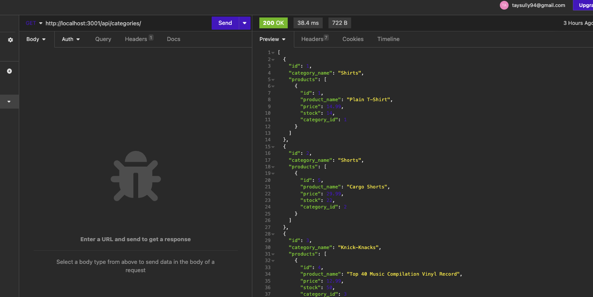

# e-commerce backend

## Are you looking to work with some API data for your e-commerce application? 
Look no further with this back-end. Add it to your half built app today! 

## Table of Contents
 
- [Installation](#installation)
- [Usage](#usage)
- [Credits](#credits)
- [License](#license)
- [Questions](#questions)

## Installation

In order to use this application, you will need to have a coding application with node installed and run an npm i for sequelize, inquirer, dotenv, and mysql2

## Usage/Tests

Once you're set up in the coding application of your choice,  run npm run seed to seed the server, then node server.js to run the server. Visit the api routes provided in the routes folders in order to check out some fake data from a fake company! 

  

## Contributing

The collaborators on this project include me, myself, and I -- tayskully
   

Tutorials followed include Columbia University EdX's Coding Bootcamp 2023, as well as:  
 [Github Docs](https://docs.github.com/en)  
 [developer mozilla](https://developer.mozilla.org/en-US/)  
 [Dev.to](https://dev.to/)  
 [Code Academy blogs](https://www.codecademy.com/resources/blog/)  
 [W3 Schools](https://www.w3schools.com/)

Special thanks to Erik Hirsch, my tutor,for the additional guidance 

## License 
    MIT License

## Questions

Reach out to me if you have any questions!
- Github: [tayskully](https://github.com/tayskully)
- LinkedIn: [linkedin.com/taylordaniellesullivan](https://www.linkedin.com/in/linkedin.com/taylordaniellesullivan/)
- Email: taysully94@gmail.com

---

## Badges

